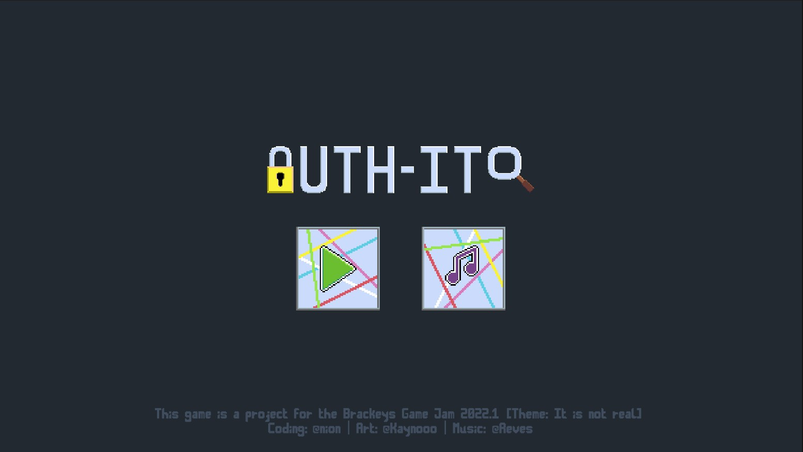
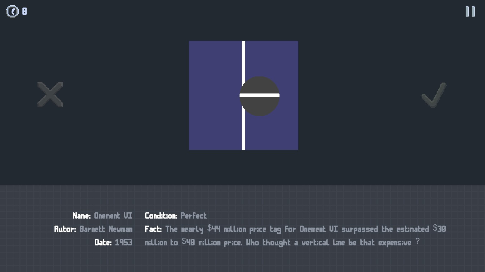

<h1 align="center">
AuthIt
 </h1>
 
<h3 align="center">
This project was made in one week as a part of <a href="https://itch.io/jam/brackeys-7">Brackeys Game Jam 2022.1</a>
</h3>

  
   

<h3 align="center">
You can play the game yourself on <a href="https://necsi.itch.io/authit">itch.io</a>
</h3>

---
> What i learned with this game:
> - using singletons for scene-persistent components, like the audio-listener
> - smoothing with 1/x after a linear curve
> - pausing coroutines
> - using scriptable objects to manage data more easily/performant
> - syncing unity projects with others via github
